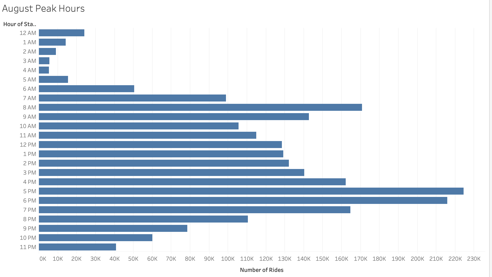
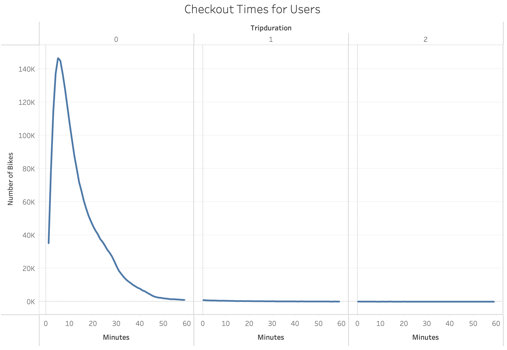
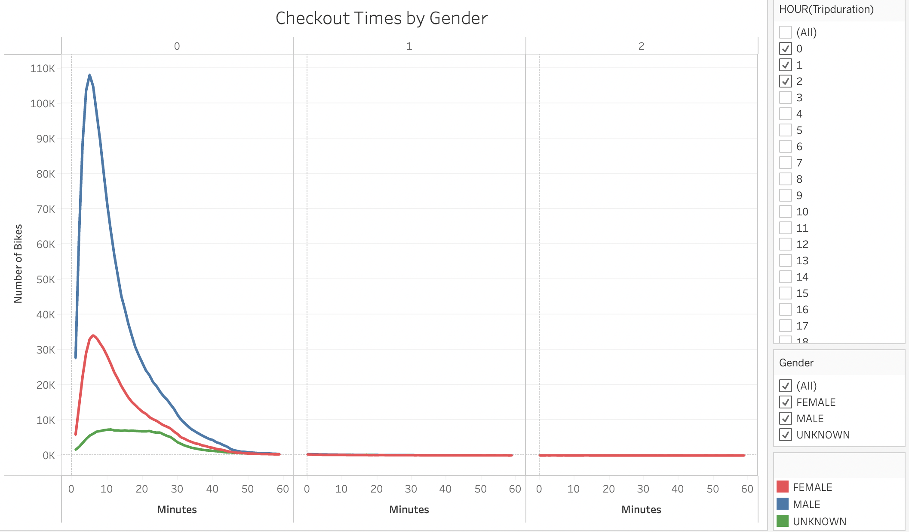
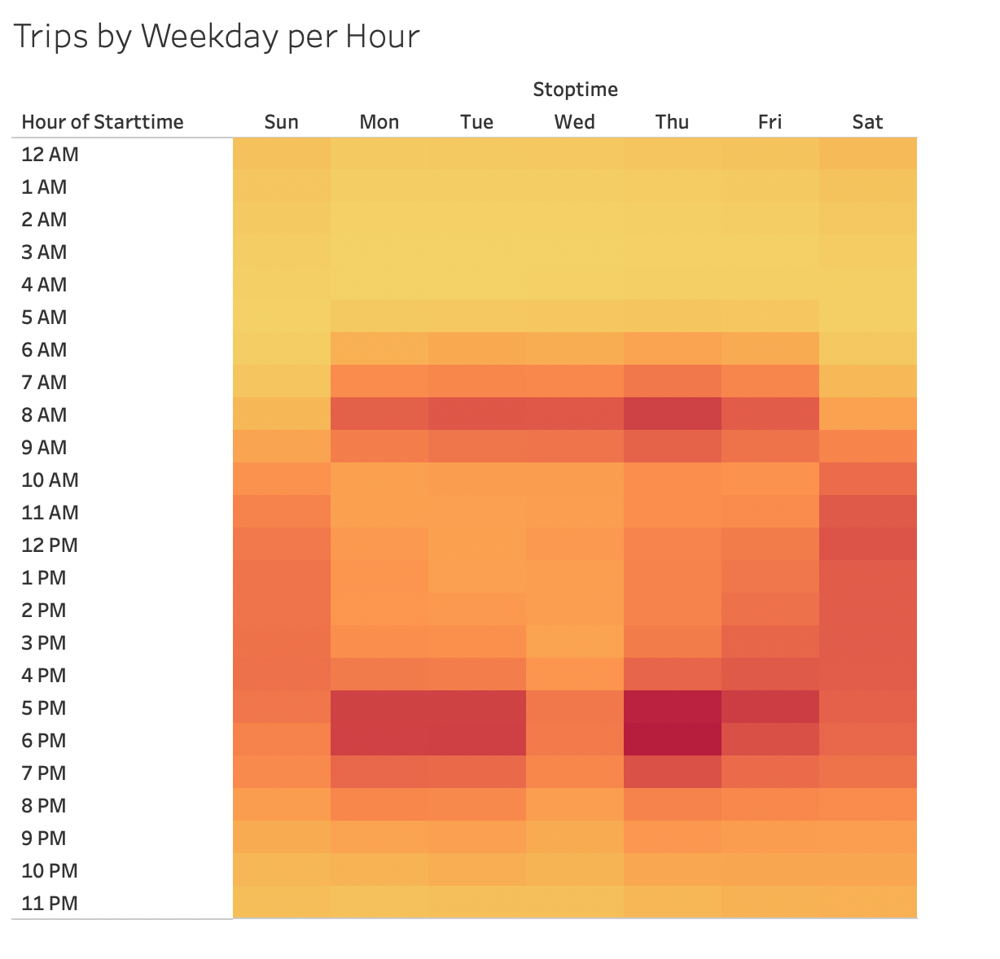
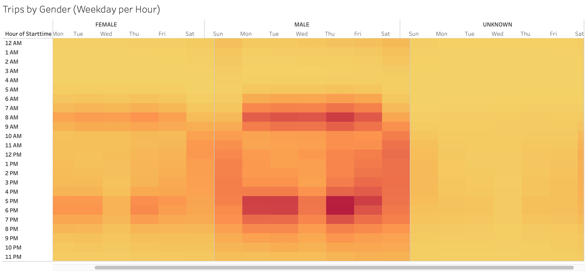
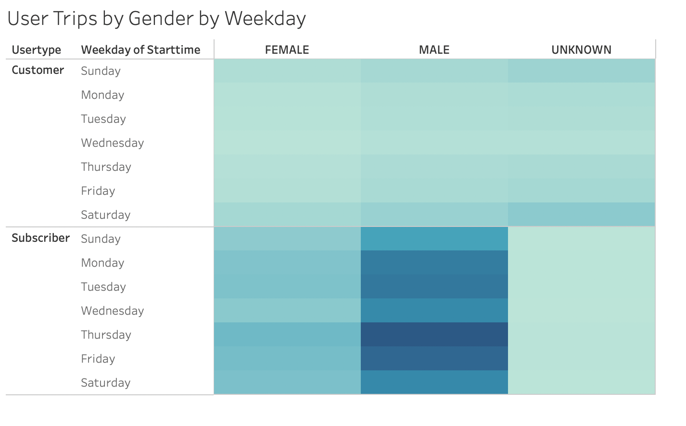
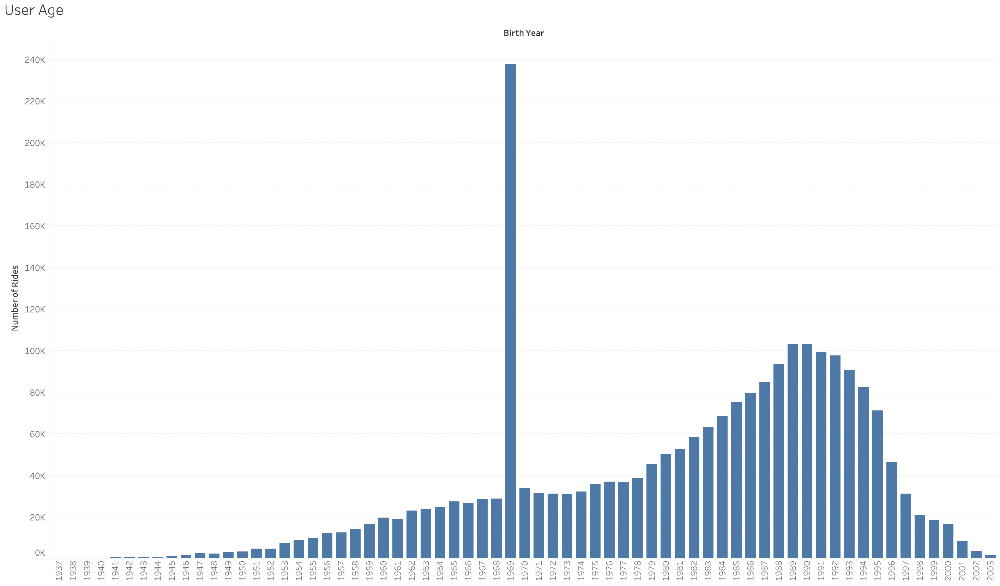
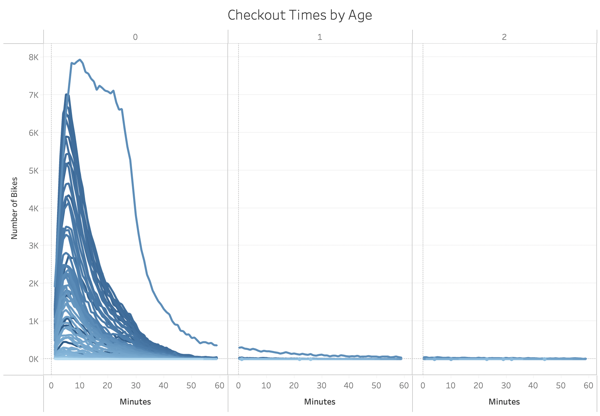

# Bikesharing
## Overview
The purpose of this analysis is to create visualizations using key data from a NYC Citibike dataset and uncover trends. 
 [Link to dashboard](https://public.tableau.com/profile/laura.godleski#!/vizhome/bikesharing_challenge_16199922432860/NYCCitibikes)

## Results

  Looking at a general overview of the Citibike data we can see that in August, there were a total of 2,344,224 bike rides. 
 
 

 Most of the users (1,900,359) were annual subscribers and 443,865 users were customers. 
 
 

 The majority of Citibike users were male - 1,530,272. 588,431 were female and 225,521 users had an unknown gender. 
 
 

  In August, the most popular time to checkout a bike was between 5 and 6 pm. 
 
 

  The trip duration for most rides was fairly short - the most common trip duration for users being about 5 minutes. 
 
 

  Both men and women shared a similar trend in trip duration, about 5-6 minutes, whereas unknown gender users had a longer trip duration ranging from aobut 10 - 20 minutes. 
 
 

  The most popular checkout time for bikes was on Thursday evenings between 5 and 6pm.
 
 

  Men and women checked out more bikes on Thursday evenings between 5 and 6pm whereas unknown gender users checked out more bikes on Saturday around 12pm. 
 
 

  The majority of subscribers, both men and women, used a Citibike on Thursday whereas customers (male, female, and gender unknown) typically checked out more bikes on Saturdays and Sundays. 

## Summary
From this analysis we can see that the majority of NYC Citibike users are annual subscribers, male, and typically checkout bikes for about 5 minutes on Thursday evenings between 5 and 6pm. Female users follow similar trends they just make up less of the total user base. For future analysis, I would suggest looking at the age ranges of users and how that impacts trip duration. 
 

 We can see that a disproportionately large group of Citibike users were born in 1969.
 
 

 These users that were born in 1969 also have the longest trip duration records, ranging from about 7 - 20 minutes. 
