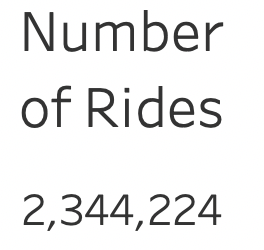
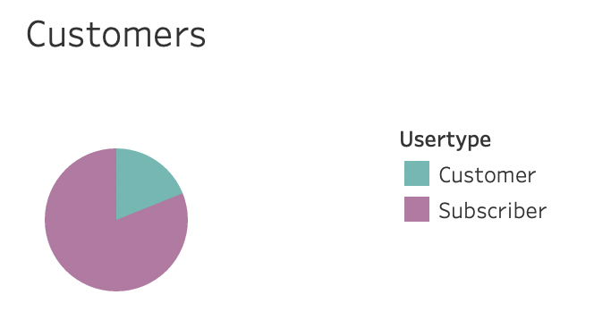
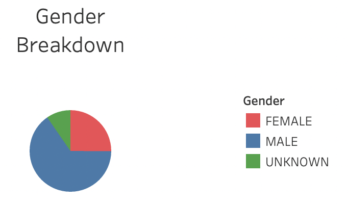

# bikesharing
## Overview
The purpose of this analysis is to create visualizations using key data from a NYC Citibike dataset and uncover trends. 
 [Link to dashboard](https://public.tableau.com/profile/laura.godleski#!/vizhome/bikesharing_challenge_16199922432860/NYCCitibikes)

## Results

  Looking at a general overview of the Citibike data we can see that in August, there were a total of 2,344,224 bike rides. 

 Most of the users (1,900,359) were annual subscribers and 443,865 users were customers. 

 The majority of Citibike users were male - 1,530,272. 588,431 were female and 225,521 users had an unknown gender. 

## Summary
provide high level summary of results and two additional visualizations that you would peform with the given dataset
